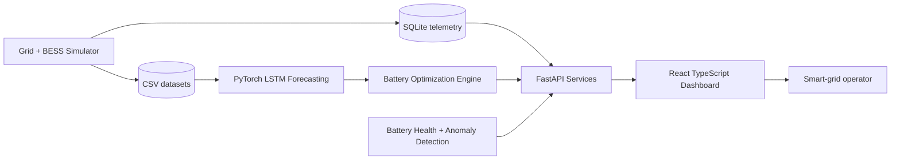

# battery-storage-optimizer

A Siemens-inspired, local-first battery energy storage optimization platform for modern smart grids. The project simulates utility-scale battery energy storage system (BESS) telemetry, forecasts demand with PyTorch LSTM models, recommends charging and discharging schedules, and visualizes grid-balancing operations in a React industrial control-center dashboard.

This repository intentionally focuses on code implementation and local execution. It does **not** include cloud deployment, Kubernetes, CI/CD pipelines, authentication, or enterprise hosting infrastructure.

## Features

- Synthetic smart-grid simulator for demand, solar, wind, grid frequency, voltage, price, peaks, load spikes, renewable overproduction, and battery degradation.
- CSV dataset generation for training, analysis, and repeatable local experiments.
- FastAPI backend with modular APIs, Pydantic schemas, services, simulators, ML modules, optimization engines, and SQLite storage.
- PyTorch LSTM demand forecaster with preprocessing, sliding-window sequence generation, train/test splitting, MAE, RMSE, MAPE, and model save/load support.
- Optimization engine for peak shaving, load balancing, energy arbitrage, grid stabilization, renewable utilization, and battery-health-aware dispatch.
- Battery analytics for SOC, SOH, remaining useful life, cycle efficiency, thermal stress, and degradation rate.
- Anomaly detection for unsafe temperatures, overcharge risk, grid overload, voltage excursions, frequency instability, and abnormal degradation symptoms.
- React + TypeScript + TailwindCSS dashboard with Recharts visualizations and a dark industrial SCADA-style UI.

## Architecture



## Repository Layout

```text
backend/app/api/              FastAPI route definitions
backend/app/ml/               LSTM forecasting, preprocessing, metrics, model persistence
backend/app/models/           Pydantic schemas
backend/app/optimization/     Battery dispatch optimization engine
backend/app/services/         Grid, analytics, and anomaly services
backend/app/simulators/       Synthetic smart-grid and BESS digital twin
backend/app/storage/          SQLite persistence helpers
backend/saved_models/         Local model artifacts generated by training
data/                         Synthetic telemetry CSV datasets
docs/                         API examples and implementation notes
frontend/                     React + TypeScript + TailwindCSS dashboard
scripts/                      Local dataset generation and model training scripts
```

## AI Forecasting Logic

The backend uses `ForecastingService` to:

1. Sort and clean telemetry records.
2. Scale demand, renewable output, price, frequency, and voltage features with Scikit-learn.
3. Generate sliding-window sequences for time-series learning.
4. Train a PyTorch LSTM with a regression head to predict future demand.
5. Split sequences into train and test windows.
6. Report MAE, RMSE, and MAPE.
7. Save the model state and scaler boundaries under `backend/saved_models/`.
8. Load saved models for API forecasts, with a statistical baseline fallback when no trained model exists.

## Optimization Strategies

The dispatch engine creates a schedule over a configurable horizon and evaluates:

- **Peak shaving:** discharge during high predicted demand windows.
- **Load balancing:** flatten net load by charging in surplus periods and discharging in stress periods.
- **Energy arbitrage:** charge during low-price intervals and discharge during high-price intervals.
- **Grid stabilization:** preserve reserve for frequency and voltage excursions.
- **Renewable-aware charging:** absorb solar/wind overproduction before curtailment.
- **Battery health preservation:** enforce SOC bands, power limits, efficiency losses, and degradation costs.

## Local Setup

### Backend

```bash
python -m venv .venv
source .venv/bin/activate
pip install -e .
python scripts/generate_dataset.py
uvicorn backend.app.main:app --reload
```

Open `http://localhost:8000/docs` for the local Swagger UI.

### Frontend

```bash
cd frontend
npm install
npm run dev
```

Open `http://localhost:5173`.

## API Examples

```bash
curl http://localhost:8000/grid/live
curl http://localhost:8000/battery/status
curl http://localhost:8000/battery/forecast?steps=48
curl http://localhost:8000/alerts
curl -X POST http://localhost:8000/model/train
curl -X POST http://localhost:8000/battery/optimize \
  -H 'Content-Type: application/json' \
  -d '{"horizon_hours":24,"initial_soc_percent":62,"objective":"balanced"}'
```

## Dashboard Screenshot Placeholders

- `docs/screenshots/dashboard-overview.png` — control-center overview.
- `docs/screenshots/dispatch-optimizer.png` — charging schedule and arbitrage view.
- `docs/screenshots/anomaly-alerts.png` — grid instability and battery health alerts.

## Future Improvements

- Reinforcement learning agent for long-horizon battery scheduling.
- Multi-battery fleet coordination across substations.
- Grid islanding and black-start simulation.
- WebSocket telemetry streaming for sub-second dashboard updates.
- Digital twin visualization with cell-module-rack hierarchy.
- More detailed electrochemical degradation and thermal models.
